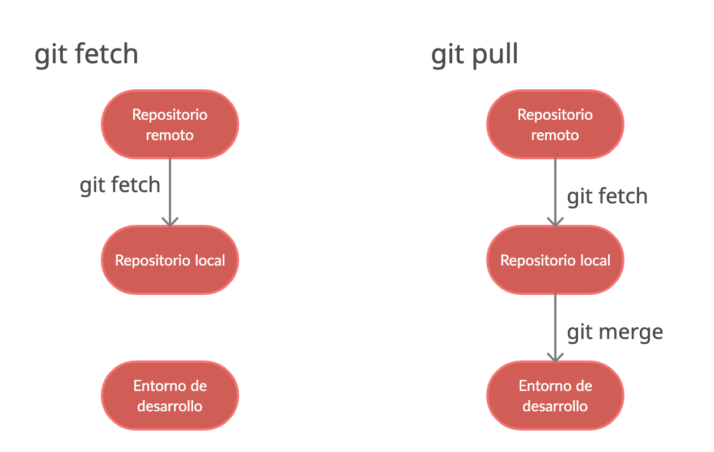

# git-basic-workshop
FSR Aktivenwochenende @hgwinfo

This is a repo to show the basic functionality of git.
You can find here some examples of how to use git.

During the Workshop you will learn the basic principles and commands to work with git.
You will also use this Repo interactive to test your skills with the commands and cause some merge conflicts.

<hr>

## git

* git is a distributed version control system. <https://git-scm.com/>
* there are alternatives to git (e.g. SubVersion)
* git can be selfhosted or hosted by a Platform (e.g. GitHub, GitLab)

### version control system

* version control system (VCS) is a system to keep track of changes in a project.
* VSC are usefull even for projects that are not developed by a team.
* You can work on several features at the same time.
* You keep a history of your files and revert your work.

## git basic principles

* git differs between origin and local
* two main principles:
  * File Lifecycle (untracked, tracked, staged, commited)
  
    * use **.gitignore** to ignore files from tracking (regexpattern)
  * Branching
    * united two branches called **merging**

### git branch using

* *master*: Deployable version of the application, stable, tested
* *develop*: More or less stable version that can be used to deploy to a test environment (not necessarily tested)
* *feature/[frontend|backend]/[featurename]* : Branches dedicated to developing new features (always derived from develop)
* *hotfix/[name]* : Branch derived from master branch to hotfix an issue that slipped through testing
* *release/[name]* : Branch derived from master branch to fix a stable version for releases

### git flow

describe the way to work with several branches.


## git basic commands

1. start working with git (after installation)
    * **git init**: Initialize a git repository
    * **git clone [url]**: Clone a git repository from a hosting platform
    *you can **fork** a public repo e.g. on github to get your copy of the repo to work with*
2. working with files localy
    * **git add [file|*]**: Add a file to the staging area (after creating or **modifiying** it)
    * **git rm [file|*]**: Remove a (removed) file from the staging area
    * **git commit -m "[message]"**: Commit the changes in the staging area
    * **git restore --staged [file|*]**: Restore a file from the staging area back to the untracked area

    * **git status**: Show the status of the staging area and the files to be added to it
    * **git log**: Show the commit-history of the repository
    * **git diff**: Show the differences between the last commit and the current state of the repository
    * **git diff [file]**: Show the differences between the last commit and the current state of the file
    * **git diff [commit]**: Show the differences between the commit and the current state of the repository
    * **git diff [commit] [file]**: Show the differences between the file in the commit and the current state of the file
    .zip over git
3. working with an remote repo
    * **git push**: Push the **commited**-changes to the remote repository
    * **git pull**: Pull the changes from the remote repository
    * **git fetch**: Fetch the changes from the remote repository
    
4. the areas in git

5. working with branches
    * **git checkout [branch]**: switch to a different branch
    * **git branch**: Show the current branches
    * **git checkout -b [branch]**: Create a new branch
      * **git push -u origin [branch]**: Push the new branch to the remote repository
6. merging
    * **git branch -D [branch]**: Delete a branch
    * **git merge [branch]**: Merge the named branche in the current
    * **git merge --abort**: Abort the current merge
    * **git merge --continue**: Continue the current merge
    *In most cases the merge will be completed automatically, in cases of an merge conflict you will have to resolve it manually by a new commit*. **In case of an mergeconflict** the following pattern will apear in the file which is in conflict:

        ```shell
        <<<<<<< HEAD
        here is some code or content from the current HEAD, probably later than you copy of this code
        =======
        here is some code or content that messed up to be appended to the HEAD
        >>>>>>> new_branch_to_merge_later
        ```

    after removing the <<<>>>-pattern and solving the conflict you must add and commit the changes.
7. stashing
    * **git stash**: Stash the current state of the working directory *in an unknown space*
    * **git stash pop**: Pop the stash and restore the state of the working directory
    * **git stash list**: Show the stashes
    * **git stash drop [stash]**: Delete a stash
    * **git stash clear**: Delete all stashes
8. tagging
    * **git tag [tag]**: Create a tag
    * **git tag -d [tag]**: Delete a tag
    * **git tag**: List all tags
    * **git tag -a [tag] -m "[message]"**: Create a tag with a message
    *on GitHub you can create tags and releases on the Website*
9. messing up and reverting things
    * **git reset --hard [commit]**: Reset the current state of the repository to the last commit with losing the changes
    * **git reset --hard HEAD~1**: Reset the current state of the repository to the last commit before the current one
    * **git reset [commit]**: Reset the current state of the repository to the last commit *without losing the changes*
    * **git revert [commit]**: Revert the current state of the repository to the last commit, a new commit in history will be created with the revert of the changes
    *a reset is not logged in the git history, a revert is logged*
    * **git rebase [branch]**: Rebase (append) the current state of the repository to the named branch and its last commit
    *when working with commits, they have unique hash ids. You can often just specify the first few chars of the hash-id*

[git-command Cheat sheet](https://education.github.com/git-cheat-sheet-education.pdf)

## tools to work with git/GitHub

* Terminal
  * best to see the diff areas of git
* VSCode (with some Extensions)
  * GitLense: see commits in the current file and compare commits
  * Git Graph: visualize the branches of the repository
* GitHub Desktop (Free) or GitKraken (Free in GitHub Edu)
  * to get around the commands just use buttons
